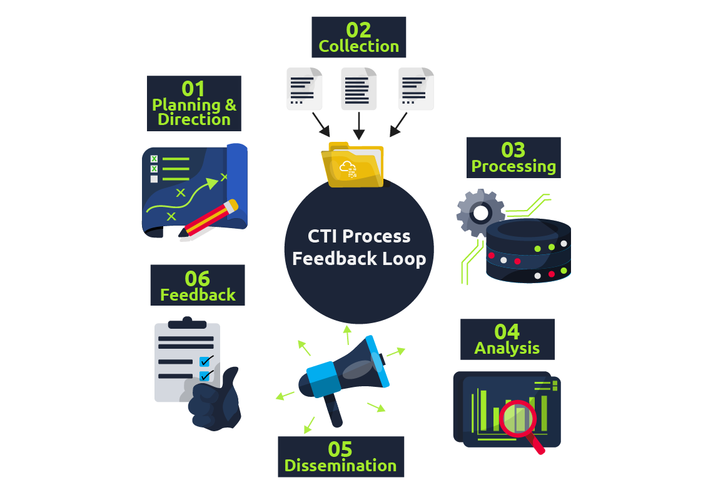
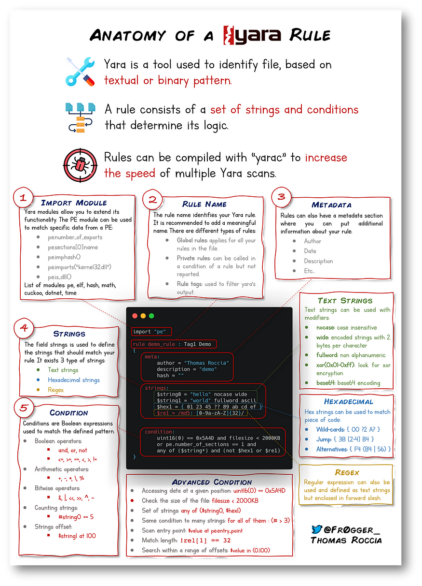
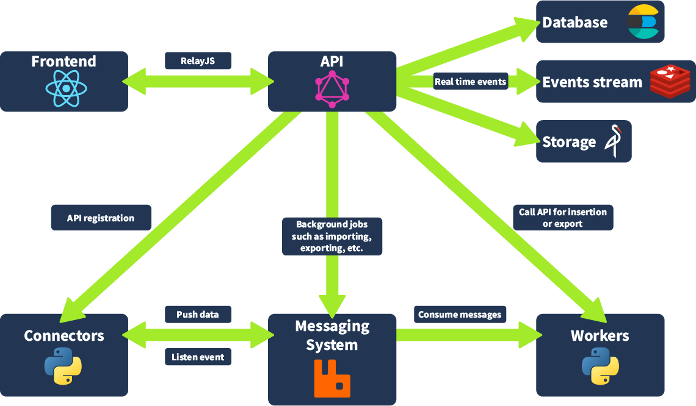
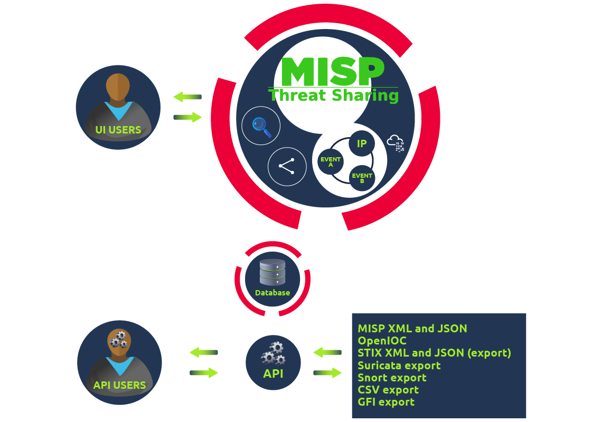

# Cyber Threat Intelligence 
# Room 7
## Cyber Threat Intelligence 
Cyber Threat Intelligence (CTI) can be defined as evidence-based knowledge about adversaries, including their indicators, tactics, motivations, and actionable advice against them. These can be utilized to protect critical assets and inform cyber security teams and management business decisions.

- **Data**: Discrete indicator associated with adversary 
- **Information**: Multiple data points that answer questions
- **Intelligence**: The correlation between data and information to extract patterns 

**Sources:**
- **Internal** 
	- Corporate security events such as vulnerability assessments and incident response reports.
	- Cyber awareness training reports.
	- System logs and events.
- **Community** 
	- Open web forums.
	- Dark web communities for cybercriminals.
- **External** 
	- Threat intel feeds (Commercial & Open-source)
	- Online marketplaces.
	- Public sources include government data, publications, social media, financial and industrial assessments.

**Threat Intelligence Classification:**
- **Strategic Intel**: High-level intel that looks into the organization's threat landscape 
- **Technical Intel**: Evidence and artifacts of attacks used by an adversary 
- **Tactical Intel**: Assesses adversary TTPs 
- **Operational Intel**: Looks into an adversary's specific motives and intent to perform an attack.

#### Data Churning 
Data churning is the process of transforming raw data to contextualized and action-oriented insights geared towards triaging security incidents. The transformation process follows 6 phases:

- **Direction**: The objective and goal, identifying the following parameters: 
	- Information assets and business processes that require defending.
	- Potential impact to be experienced on losing the assets or through process interruptions.
	- Sources of data and intel to be used towards protection.
	- Tools and resources that are required to defend the assets.
- **Collection**: After identifying the objectives, the security analysts will gather the required data by using commercial, private, and open-source resources.
- **Processing**: Due to the variety of data, it is necessary to structure it.
- **Analysis**: Driving insights from the data after processing for future decision-making that might involve: 
	- Investigating a potential threat through uncovering indicators and attack patterns.
	- Defining an action plan to avert an attack and defend the infrastructure.
	- Strengthening security controls or justifying investment for additional resources.
- **Dissemination**: Spreading the information throughout the organization.
- **Feedback**: Feedback should be regular interaction between teams to keep the lifecycle working.

# Room 8
## Threat Intelligence Tools
Threat intelligence is the analysis of data and information using tools and techniques to generate meaningful patterns on how to mitigate against threats. To mitigate against risks, we start by answering these simple questions:
- Who's attacking you?
- What's their motivation?
- What are their capabilities?
- What artifacts and indicators of compromise should you look out for?

# Room 9
## YARA
YARA is a pattern matching tool primarily developed for malware identification and classification. It's usually used as:
- **Malware detection and classification** - Security researchers use YARA to create rules that identify specific malware families based on unique patterns or signatures
- **Threat hunting** - Security teams use YARA rules to scan systems and networks for indicators of compromise
- **Incident response** - When investigating security breaches, YARA helps identify malicious files and code
- **Reverse engineering** - Researchers use YARA to find similar code patterns across different malware samples
- **Intelligence sharing** - Organizations share YARA rules to help others detect the same threats

YARA can be integrated with other libraries like:
- **Cuckoo**
	Cuckoo Sandbox is an automated malware analysis environment. This module allows you to generate YARA rules based upon the behaviors discovered from Cuckoo Sandbox. As this environment executes malware, you can create rules on specific behaviors such as runtime strings and the like.
- **Python PE**
	Python's PE module allows you to create YARA rules from the various sections and elements of the Windows Portable Executable (PE) structure.

# Room 10
## OpenCTI
OpenCTI is a tool that helps organizations manage their CTI through a centralized system. It's similar to TheHive.

[OpenCTI](https://github.com/OpenCTI-Platform/opencti) is another open-source platform designed to provide organizations with the means to manage CTI through the storage, analysis, visualization and presentation of threat campaigns, malware and IOCs.

**Types of Connectors:**

| Class                              | Description                                                  | Examples                  |
| ---------------------------------- | ------------------------------------------------------------ | ------------------------- |
| **External Input Connector**       | Ingests information from external sources                    | CVE, MISP, TheHive, MITRE |
| **Stream Connector**               | Consumes platform data stream                                | History, Tanium           |
| **Internal Enrichment Connector**  | Takes in new OpenCTI entities from user requests             | Observables enrichment    |
| **Internal Import File Connector** | Extracts information from uploaded reports                   | PDFs, STIX2 Import        |
| **Internal Export File Connector** | Exports information from OpenCTI into different file formats | CSV, STIX2 export, PDF    |

# Room 11
## **MISP - Malware Information Sharing Platform**

[MISP (Malware Information Sharing Platform)](https://www.misp-project.org/) is an open-source threat information platform that facilitates the collection, storage and distribution of threat intelligence and Indicators of Compromise (IOCs) related to malware, cyber attacks, financial fraud or any intelligence within a community of trusted members.

**MISP Use Cases:**
- **Malware Reverse Engineering**: Sharing of malware indicators to understand how different malware families function.
- **Security Investigations**: Searching, validating and using indicators in investigating security breaches.
- **Intelligence Analysis**: Gathering information about adversary groups and their capabilities.
- **Law Enforcement**: Using indicators to support forensic investigations.
- **Risk Analysis**: Researching new threats, their likelihood and occurrences.
- **Fraud Analysis**: Sharing of financial indicators to detect financial fraud.

**MISP Provides:**
- **IOC Database**: This allows for the storage of technical and non-technical information about malware samples, incidents, attackers and intelligence.
- **Automatic Correlation**: Identification of relationships between attributes and indicators from malware, attack campaigns or analysis.
- **Data Sharing**: This allows for sharing of information using different models of distributions and among different MISP instances.
- **Import & Export Features**: This allows the import and export of events in different formats to integrate other systems such as NIDS, HIDS, and OpenIOC.
- **Event Graph**: Showcases the relationships between objects and attributes identified from events.
- **API Support**: Supports integration with own systems to fetch and export events and intelligence.

# Network Security and Traffic Analysis 
# Room 1

### Traffic Analysis  
Network Security is a set of operations for protecting data, applications, devices and systems connected to the network. It is accepted as one of the significant subdomains of cyber security. It focuses on the system design, operation and management of the architecture/infrastructure to provide network accessibility, integrity, continuity and reliability. Traffic analysis (often called Network Traffic Analysis) is a subdomain of the Network Security domain, and its primary focus is investigating the network data to identify problems and anomalies.

The two core concepts that network security focuses on are "authorization" and "authentication".

**Security Control Levels:**
- **Physical**: Physical security control 
- **Technical**: Data security and access
- **Administrative**: Policies 

**The Main Approaches:**  

| Access Control                                                                                              | Threat Control                                                                                                                                |
| ----------------------------------------------------------------------------------------------------------- | --------------------------------------------------------------------------------------------------------------------------------------------- |
| The starting point of Network Security. It is a set of controls to ensure authentication and authorization. | Detecting and preventing anomalous/malicious activities on the network. It contains both internal (trusted) and external traffic data probes. |

**Access Control**

| **Firewall Protection**            | Controls incoming and outgoing network traffic with predetermined security rules. Designed to block suspicious/malicious traffic and application-layer threats while allowing legitimate and expected traffic.        |
| ---------------------------------------- | --------------------------------------------------------------------------------------------------------------------------------------------------------------------------------------------------------------------- |
| **Network Access Control (NAC)**             | Controls the devices' suitability before access to the network. Designed to verify device specifications and conditions are compliant with the predetermined profile before connecting to the network.                |
| **Identity and Access Management (IAM)** | Controls and manages the asset identities and user access to data systems and resources over the network.                                                                                                             |
| **Load Balancing**                       | Controls the resource usage to distribute (based on metrics) tasks over a set of resources and improve overall data processing flow.                                                                                  |
| **Network Segmentation**           | Creates and controls network ranges and segmentation to isolate the users' access levels, group assets with common functionalities, and improve the protection of sensitive/internal devices/data in a safer network. |
| **Virtual Private Networks (VPN)** | Creates and controls encrypted communication between devices (typically for secure remote access) over the network (including communications over the internet).                                                      |
| **Zero Trust Model**                     | Suggests configuring and implementing the access and permissions at a minimum level (providing access required to fulfill the assigned role). The mindset is focused on: "Never trust, always verify".                 |

**Threat Control**

| **Intrusion Detection and Prevention (IDS/IPS)**          | Inspects the traffic and creates alerts (IDS) or resets the connection (IPS) when detecting an anomaly/threat.                                                                                                                                                    |
| --------------------------------------------------------------- | ----------------------------------------------------------------------------------------------------------------------------------------------------------------------------------------------------------------------------------------------------------------- |
| **Data Loss Prevention (DLP)**                            | Inspects the traffic (performs content inspection and contextual analysis of the data on the wire) and blocks the extraction of sensitive data.                                                                                                                   |
| **Endpoint Protection**                                   | Protecting all kinds of endpoints and appliances that connect to the network by using a multi-layered approach like encryption, antivirus, antimalware, DLP, and IDS/IPS.                                                                                         |
| **Cloud Security**                                              | Protecting cloud/online-based systems resources from threats and data leakage by applying suitable countermeasures like VPN and data encryption.                                                                                                                  |
| **Security Information and Event Management (SIEM)**      | Technology that helps threat detection, compliance, and security incident management, through available data (logs and traffic statistics) by using event and context analysis to identify anomalies, threats, and vulnerabilities.                               |
| **Security Orchestration Automation and Response (SOAR)** | Technology that helps coordinate and automate tasks between various people, tools, and data within a single platform to identify anomalies, threats, and vulnerabilities. It also supports vulnerability management, incident response, and security operations. |
| **Network Traffic Analysis & Network Detection and Response**   | Inspecting network traffic or traffic capture to identify anomalies and threats.                                                                                                                                                                                  |

**Typical Network Security Management Operation:**  

| **Deployment**                                                                | **Configuration**                                                 | **Management**                                                                          | **Monitoring**                                                                                                           | **Maintenance**                                                                                           |
| ----------------------------------------------------------------------------- | ----------------------------------------------------------------- | --------------------------------------------------------------------------------------- | ------------------------------------------------------------------------------------------------------------------------ | --------------------------------------------------------------------------------------------------------- |
| - Device and software installation - Initial configuration - Automation | - Feature configuration - Initial network access configuration | - Security policy implementation - NAT and VPN implementation - Threat mitigation | - System monitoring - User activity monitoring - Threat monitoring - Log and traffic sample capturing | - Upgrades - Security updates - Rule adjustments - License management - Configuration updates |

# Room 2
## Snort IDS/IPS
IDS is a passive monitoring solution for detecting possible malicious activities/patterns, abnormal incidents, and policy violations. It is responsible for generating alerts for each suspicious event.

- **Network Intrusion Detection System (NIDS)** - NIDS monitors the traffic flow from various areas of the network. The aim is to investigate the traffic on the entire subnet. If a signature is identified, an alert is created.
- **Host-based Intrusion Detection System (HIDS)** - HIDS monitors the traffic flow from a single endpoint device. The aim is to investigate the traffic on a particular device. If a signature is identified, an alert is created.

IPS is an active protecting solution for preventing possible malicious activities/patterns, abnormal incidents, and policy violations. It is responsible for stopping/preventing/terminating the suspicious event as soon as the detection is performed.

- **Network Intrusion Prevention System (NIPS)** - NIPS monitors the traffic flow from various areas of the network. The aim is to protect the traffic on the entire subnet. If a signature is identified, the connection is terminated.
- **Behavior-based Intrusion Prevention System (Network Behavior Analysis - NBA)** - Behavior-based systems monitor the traffic flow from various areas of the network. The aim is to protect the traffic on the entire subnet. If an anomaly is identified, **the connection is terminated.**
- **Wireless Intrusion Prevention System (WIPS)** - WIPS monitors the traffic flow from wireless networks. The aim is to protect the wireless traffic and stop possible attacks launched from there. If a signature is identified, the connection is terminated.
- **Host-based Intrusion Prevention System (HIPS)** - HIPS actively protects the traffic flow from a single endpoint device. The aim is to investigate the traffic on a particular device. If a signature is identified, **the connection is terminated.**

**Detection/Prevention Techniques**

There are three main detection and prevention techniques used in IDS and IPS solutions:

| **Technique**    | **Approach**                                                                                                                                                                                                           |
| ---------------- | ---------------------------------------------------------------------------------------------------------------------------------------------------------------------------------------------------------------------- |
| **Signature-Based**  | This technique relies on rules that identify the specific patterns of the known malicious behavior. This model helps detect known threats.                                                                            |
| **Behavior-Based**  | This technique identifies new threats with new patterns that pass through signatures. The model compares the known/normal with unknown/abnormal behaviors. This model helps detect previously unknown or new threats. |
| **Policy-Based** | This technique compares detected activities with system configuration and security policies. This model helps detect policy violations.                                                                                |

### Snort 
#### Sniffing Mode 

| **Parameter**      | **Description**                                                                                                                                               |
| ------------------ | ------------------------------------------------------------------------------------------------------------------------------------------------------------- |
| **-v**             | Verbose. Display the TCP/IP output in the console.                                                                                                            |
| **-d**             | Display the packet data (payload).                                                                                                                            |
| **-e**             | Display the link-layer (TCP/IP/UDP/ICMP) headers.                                                                                                             |
| **-X**             | Display the full packet details in HEX.                                                                                                                       |
| **-i**             | This parameter helps to define a specific network interface to listen/sniff. Once you have multiple interfaces, you can choose a specific interface to sniff. |
| **-V / --version** | This parameter provides information about your instance version.                                                                                              |
| **-c**             | Identifying the configuration file                                                                                                                            |
| **-T**             | Snort's self-test parameter, you can test your setup with this parameter.                                                                                     |
| **-q**            | Quiet mode prevents snort from displaying the default banner and initial information about your setup.                                                        |

#### Logger Mode

| **Parameter** | **Description**                                                                                                                                                                  |
| ------------- | -------------------------------------------------------------------------------------------------------------------------------------------------------------------------------- |
| **-l**            | Logger mode, target **log and alert** output directory. Default output folder is **/var/log/snort**  The default action is to dump as tcpdump format in **/var/log/snort** |
| **-K ASCII**  | Log packets in ASCII format.                                                                                                                                                     |
| **-r**            | Reading option, read the dumped logs in Snort.                                                                                                                                   |
| **-n**        | Specify the number of packets that will process/read. Snort will stop after reading the specified number of packets.                                                             |

#### IDS/IPS Mode

| **Parameter** | **Description**                                                                                                                                                                                                                                                                                                                                                                                                                                                                                                                           |
| ------------- | ------------------------------------------------------------------------------------------------------------------------------------------------------------------------------------------------------------------------------------------------------------------------------------------------------------------------------------------------------------------------------------------------------------------------------------------------------------------------------------------------------------------------- |
| **-c**            | Defining the configuration file.                                                                                                                                                                                                                                                                                                                                                                                                                                                                                                          |
| **-T**            | Testing the configuration file.                                                                                                                                                                                                                                                                                                                                                                                                                                                                                                           |
| **-N**        | Disable logging.                                                                                                                                                                                                                                                                                                                                                                                                                                                                                                                          |
| **-D**        | Background mode.                                                                                                                                                                                                                                                                                                                                                                                                                                                                                                                          |
| **-A**        | Alert modes;  **full:** Full alert mode, providing all possible information about the alert. This one also is the default mode; once you use -A and don't specify any mode, snort uses this mode.  **fast:** Fast mode shows the alert message, timestamp, source and destination IP, along with port numbers.  **console:** Provides fast style alerts on the console screen.  **cmg:** CMG style, basic header details with payload in hex and text format.  **none:** Disabling alerting. |

**The Berkeley Packet Filter (BPF)**
We can run snort only using snort without a config file: 
`sudo snort -c /etc/snort/rules/local_rule -A console`

**IPS Mode and Dropping Packets**
Snort IPS mode is activated with `--Q --daq afpacket` parameters. You can also activate this mode by editing snort.conf file. 
Activate the Data Acquisition (DAQ) modules and use the afpacket module to use snort as an IPS: `-i eth0:eth1`
`snort -c /etc/snort/rules/local.rules -q -Q --daq afpacket -i eth0:eth1 -A console` 

#### PCAP Mode 

| **Parameter**           | **Description**                                   |
| ----------------------- | ------------------------------------------------- |
| **-r / --pcap-single=** | Read a single pcap                                |
| **--pcap-list=""**      | Read pcaps provided in command (space separated). |
| **--pcap-show**         | Show pcap name on console during processing.      |

`sudo snort -c /etc/snort/snort.conf -q --pcap-list="icmp-test.pcap http2.pcap" -A console -n 10`

#### Snort Rules

Rules cannot be processed without a header. Rule options are "optional" parts. However, it is almost impossible to detect sophisticated attacks without using the rule options.

| **Action**   | There are several actions for rules. Make sure you understand the functionality and test it before creating rules for live systems. The most common actions are listed below.  - **alert:** Generate an alert and log the packet. - **log:** Log the packet. - **drop:** Block and log the packet. - **reject:** Block the packet, log it and terminate the packet session.                                                                    |
| -------- | --------------------------------------------------------------------------------------------------------------------------------------------------------------------------------------------------------------------------------------------------------------------------------------------------------------------------------------------------------------------------------------------------------------------------------------------- |
| **Protocol** | Protocol parameter identifies the type of the protocol that is filtered for the rule.  Note that Snort2 supports only four protocol filters in the rules (IP, TCP, UDP and ICMP). However, you can detect the application flows using port numbers and options. For instance, if you want to detect FTP traffic, you cannot use the FTP keyword in the protocol field but filter the FTP traffic by investigating TCP traffic on port 21. |

| **IP Filtering**                 | `alert icmp 192.168.1.56 any <> any any (msg: "ICMP Packet From "; sid: 100001; rev:1;)`  This rule will create an alert for each ICMP packet originating from the 192.168.1.56 IP address.                                                                                                             |
| ---------------------------- | ---------------------------------------------------------------------------------------------------------------------------------------------------------------------------------------------------------------------------------------------------------------------------------------------------------------------------- |
| **Filter an IP Range**           | `alert icmp 192.168.1.0/24 any <> any any (msg: "ICMP Packet Found"; sid: 100001; rev:1;)`  This rule will create an alert for each ICMP packet originating from the 192.168.1.0/24 subnet.                                                                                                                             |
| **Filter Multiple IP Ranges**    | `alert icmp [192.168.1.0/24, 10.1.1.0/24] any <> any any (msg: "ICMP Packet Found"; sid: 100001; rev:1;)`  This rule will create an alert for each ICMP packet originating from the 192.168.1.0/24 and 10.1.1.0/24 subnets.                                                                                             |
| **Exclude IP Addresses/Ranges**  | "Negation operator" is used for excluding specific addresses and ports. Negation operator is indicated with "!"  `alert icmp !192.168.1.0/24 any <> any any (msg: "ICMP Packet Found"; sid: 100001; rev:1;)`  This rule will create an alert for each ICMP packet not originating from the 192.168.1.0/24 subnet. |
| **Port Filtering**               | `alert tcp any any <> any 21 (msg: "FTP Port 21 Command Activity Detected"; sid: 100001; rev:1;)`  This rule will create an alert for each TCP packet sent to port 21.                                                                                                                                                  |
| **Exclude a Specific Port**      | `alert tcp any any <> any !21 (msg: "Traffic Activity Without FTP Port 21 Command Channel"; sid: 100001; rev:1;)`  This rule will create an alert for each TCP packet not sent to port 21.                                                                                                                              |
| **Filter a Port Range (Type 1)** | `alert tcp any any <> any 1:1024 (msg: "TCP 1-1024 System Port Activity"; sid: 100001; rev:1;)`  This rule will create an alert for each TCP packet sent to ports between 1-1024.                                                                                                                                      |
| **Filter a Port Range (Type 2)** | `alert tcp any any <> any :1024 (msg: "TCP 0-1024 System Port Activity"; sid: 100001; rev:1;)`  This rule will create an alert for each TCP packet sent to ports less than or equal to 1024.                                                                                                                           |
| **Filter a Port Range (Type 3)** | `alert tcp any any <> any 1025: (msg: "TCP Non-System Port Activity"; sid: 100001; rev:1;)`  This rule will create an alert for each TCP packet sent to source port higher than or equal to 1025.                                                                                                                        |
| **Filter a Port Range (Type 4)** | `alert tcp any any <> any [21,23] (msg: "FTP and Telnet Port 21-23 Activity Detected"; sid: 100001; rev:1;)`  This rule will create an alert for each TCP packet sent to port 21 and 23.                                                                                                                                 |

**General Rule Options**

| **Msg**       | The message field is a basic prompt and quick identifier of the rule. Once the rule is triggered, the message field will appear in the console or log. Usually, the message part is a one-liner that summarizes the event.                                                                                                                                                                                                                                                                                                                                |
| --------- | --------------------------------------------------------------------------------------------------------------------------------------------------------------------------------------------------------------------------------------------------------------------------------------------------------------------------------------------------------------------------------------------------------------------------------------------------------------------------------------------------------------------------------------------------------- |
| **Sid**       | Snort rule IDs (SID) come with a pre-defined scope, and each rule must have a SID in a proper format. There are three different scopes for SIDs shown below.  - **<100:** Reserved rules - **100-999,999:** Rules came with the build. - **>=1,000,000:** Rules created by user.  Briefly, the rules we will create should have sid greater than 100,000,000. Another important point is; SIDs should not overlap, and each id must be unique.                                                                                                      |
| **Reference** | Each rule can have additional information or reference to explain the purpose of the rule or threat pattern. That could be a Common Vulnerabilities and Exposures (CVE) id or external information. Having references for the rules will always help analysts during the alert and incident investigation.                                                                                                                                                                                                                                                |
| **Rev**       | Snort rules can be modified and updated for performance and efficiency issues. Rev option helps analysts to have the revision information of each rule. Therefore, it will be easy to understand rule improvements. Each rule has its unique rev number, and there is no auto-backup feature on the rule history. Analysts should keep the rule history themselves. Rev option is only an indicator of how many times the rule had revisions.  `alert icmp any any <> any any (msg: "ICMP Packet Found"; sid: 100001; reference:cve,CVE-XXXX; rev:1;)` |

**Payload Detection Rule Options**

| **Content**      | Payload data. It matches specific payload data by ASCII, HEX or both. It is possible to use this option multiple times in a single rule. However, the more you create specific pattern match features, the more it takes time to investigate a packet.  Following rules will create an alert for each HTTP packet containing the keyword "GET". This rule option is case sensitive!  - **ASCII mode** - `alert tcp any any <> any 80 (msg: "GET Request Found"; content:"GET"; sid: 100001; rev:1;)` - **HEX mode** - `alert tcp any any <> any 80 (msg: "GET Request Found"; content:"|47 45 54|"; sid: 100001; rev:1;)`                                                                                                           |
| ------------ | ------------------------------------------------------------------------------------------------------------------------------------------------------------------------------------------------------------------------------------------------------------------------------------------------------------------------------------------------------------------------------------------------------------------------------------------------------------------------------------------------------------------------------------------------------------------------------------------------------------------------------------------------------------------------------------------------------------------------------------------ |
| **Nocase**       | Disabling case sensitivity. Used for enhancing the content searches.  `alert tcp any any <> any 80 (msg: "GET Request Found"; content:"GET"; nocase; sid: 100001; rev:1;)`                                                                                                                                                                                                                                                                                                                                                                                                                                                                                                                                                            |
| **Fast_pattern** | Prioritize content search to speed up the payload search operation. By default, Snort uses the biggest content and evaluates it against the rules. "fast_pattern" option helps you select the initial packet match with the specific value for further investigation. This option always works case insensitive and can be used once per rule. Note that this option is required when using multiple "content" options.  The following rule has two content options, and the fast_pattern option tells snort to use the first content option (in this case, "GET") for the initial packet match.  `alert tcp any any <> any 80 (msg: "GET Request Found"; content:"GET"; fast_pattern; content:"www"; sid:100001; rev:1;)` |

**Non-Payload Detection Rule Options**

| **ID**     | Filtering the IP id field.  `alert tcp any any <> any any (msg: "ID TEST"; id:123456; sid: 100001; rev:1;)`                                                                                  |
| ------ | ------------------------------------------------------------------------------------------------------------------------------------------------------------------------------------------------ |
| **Flags**  | Filtering the TCP flags.  - **F** - FIN - **S** - SYN - **R** - RST - **P** - PSH - **A** - ACK - **U** - URG  `alert tcp any any <> any any (msg: "FLAG TEST"; flags:S; sid: 100001; rev:1;)` |
| **Dsize**  | Filtering the packet payload size.  - `dsize:min<>max;` - `dsize:>100` - `dsize:<100`  `alert ip any any <> any any (msg: "SEQ TEST"; dsize:100<>300; sid: 100001; rev:1;)`           |
| **Sameip** | Filtering the source and destination IP addresses for duplication.  `alert ip any any <> any any (msg: "SAME-IP TEST"; sameip; sid: 100001; rev:1;)`                                        |

**Path to local rules:** `/etc/snort/rules/local.rules`

**Main Components of Snort**

- **Packet Decoder** - Packet collector component of Snort. It collects and prepares the packets for pre-processing. 
- **Pre-processors** - A component that arranges and modifies the packets for the detection engine.
- **Detection Engine** - The primary component that processes, dissects and analyzes the packets by applying the rules. 
- **Logging and Alerting** - Log and alert generation component.
- **Outputs and Plugins** - Output integration modules (i.e. alerts to syslog/mysql) and additional plugin (rule management detection plugins) support is done with this component.

**There are three types of rules available for Snort:**
- **Community Rules** - Free ruleset under the GPLv2. Publicly accessible, no need for registration.
- **Registered Rules** - Free ruleset (requires registration). This ruleset contains subscriber rules with 30 days delay.
- **Subscriber Rules (Paid)** - Paid ruleset (requires subscription). This ruleset is the main ruleset and is updated twice a week (Tuesdays and Thursdays).

