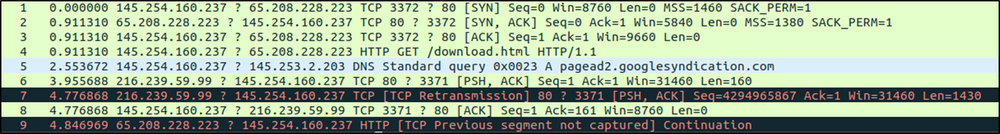
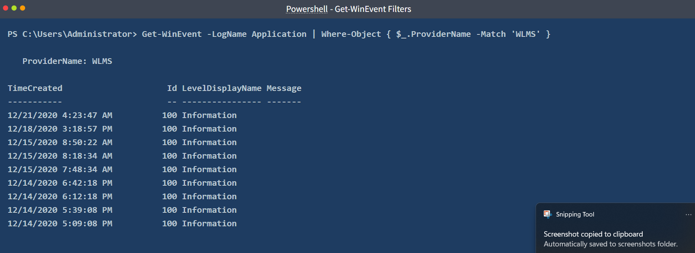

# Room 1
## TShark 
	TShark is a text absed tool for traffic analysis created by the same person of wireshark 
	
| **Tool/Utility** | **Purpose and Benefit**                                                                                                                                |
| ---------------- | ------------------------------------------------------------------------------------------------------------------------------------------------------ |
| **capinfos**     | A program that provides details of a specified capture file. It is suggested to view the summary of the capture file before starting an investigation. |
| **grep**         | Helps search plain-text data.                                                                                                                          |
| **cut**          | Helps cut parts of lines from a specified data source.                                                                                                 |
| **uniq**         | Filters repeated lines/values.                                                                                                                         |
| **nl**           | Views the number of shown lines.                                                                                                                       |
| **sed**          | A stream editor.                                                                                                                                       |
| **awk**          | Scripting language that helps pattern search and processing.                                                                                           |

| **Parameter**               | **Purpose**                                                                                                                                                                                                                                                                                                                                                                                                                                                                                                          |
| --------------------------- | -------------------------------------------------------------------------------------------------------------------------------------------------------------------------------------------------------------------------------------------------------------------------------------------------------------------------------------------------------------------------------------------------------------------------------------------------------------------------------------------------------------------- |
| -h                          | - Display the help page with the most common features.<br>- `tshark -h`                                                                                                                                                                                                                                                                                                                                                                                                                                              |
| -v                          | - Show version info.<br>- `tshark -v`                                                                                                                                                                                                                                                                                                                                                                                                                                                                                |
| -D                          | - List available sniffing interfaces.<br>- `tshark -D`                                                                                                                                                                                                                                                                                                                                                                                                                                                               |
| -i                          | - Choose an interface to capture live traffic.<br>- `tshark -i 1`<br>- `tshark -i ens55`                                                                                                                                                                                                                                                                                                                                                                                                                             |
| **No Parameter**            | - Sniff the traffic like tcpdump.<br>- `tshark`                                                                                                                                                                                                                                                                                                                                                                                                                                                                      |
|                             |                                                                                                                                                                                                                                                                                                                                                                                                                                                                                                                      |
| **Parameter**               | **Purpose**                                                                                                                                                                                                                                                                                                                                                                                                                                                                                                          |
| -r                          | - Read/input function. Read a capture file.<br>- `tshark -r demo.pcapng`                                                                                                                                                                                                                                                                                                                                                                                                                                             |
| -c                          | - Packet count. Stop after capturing a specified number of packets.<br>- E.g. stop after capturing/filtering/reading 10 packets.<br>- `tshark -c 10`                                                                                                                                                                                                                                                                                                                                                                 |
| -w                          | - Write/output function. Write the sniffed traffic to a file.<br>- `tshark -w sample-capture.pcap`                                                                                                                                                                                                                                                                                                                                                                                                                   |
| -V                          | - Verbose.<br>- Provide detailed information **for each packet**. This option will provide details similar to Wireshark's "Packet Details Pane".<br>- `tshark -V`                                                                                                                                                                                                                                                                                                                                                    |
| -q                          | - Silent mode.<br>- Suspress the packet outputs on the terminal.<br>- `tshark -q`                                                                                                                                                                                                                                                                                                                                                                                                                                    |
| -x                          | - Display packet bytes.<br>- Show packet details in hex and ASCII dump for each packet.<br>- `tshark -x`                                                                                                                                                                                                                                                                                                                                                                                                             |
|                             |                                                                                                                                                                                                                                                                                                                                                                                                                                                                                                                      |
| **Parameter**               | **Purpose**                                                                                                                                                                                                                                                                                                                                                                                                                                                                                                          |
|                             | Define capture conditions for a single run/loop. STOP after completing the condition. Also known as "Autostop".                                                                                                                                                                                                                                                                                                                                                                                                      |
| -a                          | - **Duration:** Sniff the traffic and stop after X seconds. Create a new file and write output to it.  <br>    <br><br>- `tshark -w test.pcap -a duration:1`<br><br>- **Filesize:** Define the maximum capture file size. Stop after reaching X file size (KB).<br><br>- `tshark -w test.pcap -a filesize:10`<br><br>- **Files:** Define the maximum number of output files. Stop after X files.<br><br>- `tshark -w test.pcap -a filesize:10 -a files:3`                                                            |
|                             | Ring buffer control options. Define capture conditions for multiple runs/loops. (INFINITE LOOP).                                                                                                                                                                                                                                                                                                                                                                                                                     |
| -b                          | - **Duration:** Sniff the traffic for X seconds, create a new file and write output to it.   <br>    <br><br>- `tshark -w test.pcap -b duration:1`<br><br>- **Filesize:** Define the maximum capture file size. Create a new file and write output to it after reaching filesize X (KB).<br><br>- `tshark -w test.pcap -b filesize:10`<br><br>- **Files:** Define the maximum number of output files. Rewrite the first/oldest file after creating X files.<br><br>- `tshark -w test.pcap -b filesize:10 -b files:3` |
|                             |                                                                                                                                                                                                                                                                                                                                                                                                                                                                                                                      |
| **Parameter**               | **Purpose**                                                                                                                                                                                                                                                                                                                                                                                                                                                                                                          |
| -f                          | Capture filters. Same as BPF syntax and Wireshark's capture filters.                                                                                                                                                                                                                                                                                                                                                                                                                                                 |
| -Y                          | Display filters. Same as **Wireshark's display filters.**                                                                                                                                                                                                                                                                                                                                                                                                                                                            |
|                             |                                                                                                                                                                                                                                                                                                                                                                                                                                                                                                                      |
| **Qualifier**               | **Details and Available Options**                                                                                                                                                                                                                                                                                                                                                                                                                                                                                    |
| **Type**                    | Target match type. You can filter IP addresses, hostnames, IP ranges, and port numbers. Note that if you don't set a qualifier, the "host" qualifier will be used by default.<br><br>- host \| net \| port \| portrange<br>- Filtering a host<br><br>- `tshark -f "host 10.10.10.10"`<br><br>- Filtering a network range <br><br>- `tshark -f "net 10.10.10.0/24"`<br><br>- Filtering a Port<br><br>- `tshark -f "port 80"`<br><br>- Filtering a port range<br><br>- `tshark -f "portrange 80-100"`                  |
| **Direction**               | Target direction/flow. Note that if you don't use the direction operator, it will be equal to "either" and cover both directions.<br><br>- src \| dst<br>- Filtering source address<br><br>- `tshark -f "src host 10.10.10.10"`<br><br>- Filtering destination address<br><br>- `tshark -f "dst host 10.10.10.10"`                                                                                                                                                                                                   |
| **Protocol**                | Target protocol.<br><br>- arp \| ether \| icmp \| ip \| ip6 \| tcp \| udp<br>- Filtering TCP<br><br>- `tshark -f "tcp"`<br><br>- Filtering MAC address<br><br>- `tshark -f "ether host F8:DB:C5:A2:5D:81"`<br><br>- You can also filter protocols with IP Protocol numbers assigned by IANA.<br>- Filtering IP Protocols 1 (ICMP)<br><br>- `tshark -f "ip proto 1"`<br>- [**Assigned Internet Protocol Numbers**](https://www.iana.org/assignments/protocol-numbers/protocol-numbers.xhtml)                          |
|                             |                                                                                                                                                                                                                                                                                                                                                                                                                                                                                                                      |
| **Capture Filter Category** | **Details**                                                                                                                                                                                                                                                                                                                                                                                                                                                                                                          |
| **Host Filtering**          | Capturing traffic to or from a specific host.<br><br>- Traffic generation with cURL. This command sends a default HTTP query to a specified address.<br><br>- `curl tryhackme.com`<br><br>- TShark capture filter for a host<br><br>- `tshark -f "host tryhackme.com"`                                                                                                                                                                                                                                               |
| **IP Filtering**            | Capturing traffic to or from a specific port. We will use the Netcat tool to create noise on specific ports.<br><br>- Traffic generation with Netcat. Here Netcat is instructed to provide details (verbosity), and timeout is set to 5 seconds.<br><br>- `nc 10.10.10.10 4444 -vw 5`<br><br>- TShark capture filter for specific IP address<br><br>- `tshark -f "host 10.10.10.10"`                                                                                                                                 |
| **Port Filtering**          | Capturing traffic to or from a specific port. We will use the Netcat tool to create noise on specific ports.<br><br>- Traffic generation with Netcat. Here Netcat is instructed to provide details (verbosity), and timeout is set to 5 seconds.<br><br>- `nc 10.10.10.10 4444 -vw 5`<br><br>- TShark capture filter for port 4444<br><br>- `tshark -f "port 4444"`                                                                                                                                                  |
| **Protocol Filtering**      | Capturing traffic to or from a specific protocol. We will use the Netcat tool to create noise on specific ports.<br><br>- Traffic generation with Netcat. Here Netcat is instructed to use UDP, provide details (verbosity), and timeout is set to 5 seconds.<br><br>- `nc -u 10.10.10.10 4444 -vw 5`<br><br>- TShark capture filter for<br><br>- `tshark -f "udp"`                                                                                                                                                  |
|                             |                                                                                                                                                                                                                                                                                                                                                                                                                                                                                                                      |
| **Display Filter Category** | **Details and Available Options**                                                                                                                                                                                                                                                                                                                                                                                                                                                                                    |
| **Protocol: IP**            | - Filtering an IP without specifying a direction.  <br>    <br><br>- `tshark -Y 'ip.addr == 10.10.10.10'`<br><br>- Filtering a network range <br><br>- `tshark -Y 'ip.addr == 10.10.10.0/24'`<br><br>- Filtering a source IP<br><br>- `tshark -Y 'ip.src == 10.10.10.10'`<br><br>- Filtering a destination IP<br><br>- `tshark -Y 'ip.dst == 10.10.10.10'`                                                                                                                                                           |
| **Protocol: TCP**           | - Filtering TCP port  <br>    <br><br>- `tshark -Y 'tcp.port == 80'`<br><br>- Filtering source TCP port<br><br>- `tshark -Y 'tcp.srcport == 80'`                                                                                                                                                                                                                                                                                                                                                                     |
| **Protocol: HTTP**          | - Filtering HTTP packets  <br>    <br><br>- `tshark -Y 'http'`<br><br>- Filtering HTTP packets with response code "200"<br><br>- `tshark -Y "http.response.code == 200"`                                                                                                                                                                                                                                                                                                                                             |
| **Protocol: DNS**           | - Filtering DNS packets  <br>    <br><br>- `tshark -Y 'dns'`<br><br>- Filtering all DNS "A" packets<br><br>- `tshark -Y 'dns.qry.type == 1`                                                                                                                                                                                                                                                                                                                                                                          |
## TShark advance filtering
#### Statistic 

| **Parameter** | **Purpose**                                                                                                                                                                                                                                                                                                                                                                                                    |
| ------------- | -------------------------------------------------------------------------------------------------------------------------------------------------------------------------------------------------------------------------------------------------------------------------------------------------------------------------------------------------------------------------------------------------------------- |
| --color       | - Wireshark-like colourised output.<br>- `tshark --color`                                                                                                                                                                                                                                                                                                                                                      |
| -z            | - Statistics<br>- There are multiple options available under this parameter. You can view the available filters under this parameter with:<br><br>- `tshark -z help`<br><br>- Sample usage.<br><br>- `tshark -z filter`<br><br>- Each time you filter the statistics, packets are shown first, then the statistics provided. You can suppress packets and focus on the statistics by using the `-q` parameter. |
|               |                                                                                                                                                                                                                                                                                                                                                                                                                |
| **Parameter** | **Purpose**                                                                                                                                                                                                                                                                                                                                                                                                    |
| --color       | - Wireshark-like colourised output.<br>- `tshark --color`                                                                                                                                                                                                                                                                                                                                                      |
| -z            | - Statistics<br>- There are multiple options available under this parameter. You can view the available filters under this parameter with:<br><br>- `tshark -z help`<br><br>- Sample usage.<br><br>- `tshark -z filter`<br><br>- Each time you filter the statistics, packets are shown first, then the statistics provided. You can suppress packets and focus on the statistics by using the `-q` parameter. |


```
 Protocol Hierarchy
user@ubuntu$ tshark -r demo.pcapng -z io,phs -q
Packet Lengths Tree
user@ubuntu$ tshark -r demo.pcapng -z plen,tree -q
Endpoints
user@ubuntu$ tshark -r demo.pcapng -z endpoints,ip -q
Conversations
user@ubuntu$ tshark -r demo.pcapng -z conv,ip -q
Expert Info
user@ubuntu$ tshark -r demo.pcapng -z expert -q
IPv4 and IPv6
tshark -r demo.pcapng -z ptype,tree -q
- **IPv4:** `-z ip_hosts,tree -q`
- **IPv6:** `-z ipv6_hosts,tree -q`
user@ubuntu$ tshark -r demo.pcapng -z ip_hosts,tree -q
- IPv4: `-z ip_srcdst,tree -q`
- IPv6: `-z ipv6_srcdst,tree -q`
user@ubuntu$ tshark -r demo.pcapng -z ip_srcdst,tree -q
- IPv4: `-z dests,tree -q`
- IPv6: `-z ipv6_dests,tree -q`
user@ubuntu$ tshark -r demo.pcapng -z dests,tree -q
http 
- **Packet and status counter for HTTP:** `-z http,tree -q`
- **Packet and status counter for HTTP2:** `-z http2,tree -q`
- **Load distribution:** `-z http_srv,tree -q`
- **Requests:** `-z http_req,tree -q`
- **Requests and responses:** `-z http_seq,tree -q`
Stream 
- **TCP Streams:** `-z follow,tcp,ascii,0 -q`
- **UDP Streams:** `-z follow,udp,ascii,0 -q`
- **HTTP Streams:** `-z follow,http,ascii,0 -q`
Export object 
--export-objects http,/home/ubuntu/Desktop/extracted-by-tshark -q
Extract Fields
 -T fields -e ip.src -e ip.dst -E header=y
 
```

[[Extraction ]]

# End-point Security Monitoring 
# Room 1
#### Task manager (Windows)
Task Manager is a built-in GUI-based Windows utility that allows users to see what is running on the Windows system. It also provides information on resource usage, such as how much each process utilizes CPU and memory. When a program is not responding, the Task Manager is used to terminate the process.
here is summary of the process that are considered normal behavior
- System
- System > smss.exe
- csrss.exe
- wininit.exe
- wininit.exe > services.exe
- wininit.exe > services.exe > svchost.exe
- lsass.exe
- winlogon.exe
- explorer.exe
#### Sysinternals
Is a compilation of over 70 windows base tool 
- File and Disk Utilities
- Networking Utilities
- Process Utilities
- Security Utilities
- System Information
- Miscellaneous
here we will see two utility used for end-point security 
- TCPView : networking tool
- Process Explorer: Process tool 
#### Windows Event Logs
The Windows Event Logs are not text files that can be viewed using a text editor. However, the raw data can be translated into XML using the Windows API. The events in these log files are stored in a proprietary binary format with a .evt or .evtx extension. The log files with the .evtx file extension typically reside in `C:\Windows\System32\winevt\Logs`.
There are three main ways of accessing these event logs within a Windows system:
1. Event Viewer (GUI-based application)
2. Wevtutil.exe (command-line tool)
3. Get-WinEvent (PowerShell cmdlet)
#### Sysmon
#### OSQuery
Osquery is an open-source tool created by Facebook. With Osquery, Security Analysts, Incident Responders, and Threat Hunters can query an endpoint (or multiple endpoints) using SQL syntax. Osquery can be installed on various platforms: Windows, Linux, macOS, and FreeBSD
#### Wazuh
Wazuh is an open-source, freely available, and extensive EDR (is a series of tool for end-point detection and response ) solution, which Security Engineers can deploy in all scales of environments.
As mentioned, Wazuh is an EDR; let's briefly run through what an EDR is. Endpoint detection and response (EDR) are tools and applications that monitor devices for an activity that could indicate a threat or security breach. These tools and applications have features that include:  

- Auditing a device for common vulnerabilities
- Proactively monitoring a device for suspicious activity such as unauthorized logins, brute-force attacks, or privilege escalations.
- Visualizing complex data and events into neat and trendy graphs
- Recording a device's normal operating behaviour to help with detecting anomalies

# Room 2
## Windows core process 
#### Task manager 
In windows the process are categorized under three type :
- app
- windows processes 
- background processes
Windows process:
- **system** is the home for kernel process always have the pid 4
-  **smss.exe** "Session Manager Subsystem" the first the first user mode process started it lunches two essential process 
	- **winlogon.exe** : responsible for user login  is responsible for handling the **Secure Attention Sequence** (SAS). It is the ALT+CTRL+DELETE key combination users press to enter their username & password. This process is also responsible for loading the user profile. It loads the user's NTUSER.DAT into HKCU, and userinit.exe loads the user's shell. 
		-  **userinit.exe**
			-  **explorer.exe** this process gives the user access to their folders and files. It also provides functionality for other features, such as the Start Menu and Taskbar.
	- **csrss.exe** : responsible for other server client proecss |have no parent it get called by smss and them self terminat 
	- **wininit.exe** is responsible for lunching services.exe,  lsass.exe, lsaiso.exe
		- **services.exe**  : it main responsibility is to hundel system service 
			- **svchost.exe**, is responsible for hosting and managing Windows services.
		- **lsass.exe** "Local Security Authority Subsystem Service (**LSASS**) is a process in Microsoft Windows operating systems that is responsible for enforcing the security policy on the system. It verifies users logging on to a Windows computer or server, handles password changes, and creates access tokens. It also writes to the Windows Security Log."

# Room 3
## # Sysinternals
is  a list of tools that are organized in one suite for windows computer it contain multiple tool that are categorized under 
- File and Disk Utilities
- Networking Utilities
- Process Utilities
- Security Utilities
- System Information
- Miscellaneous

for working with live sysinternals you nee to do two thing 
- start the webClient process 
- Enable Network discovery trought the control center 
### Disk utility 
#### **Sigcheck** 
is one of the tools used for disk analysis it's a command line tool 
for example `sigcheck -u -e C:\Windows\System32`
#### **Streams**
for checking NFTS file system 
	Alternate Data Streams (ADS) is a file attribute specific to Windows NTFS (New Technology File System). Every file has at least one data stream ($DATA) and ADS allows files to contain more than one stream of data. Natively Window Explorer doesn't display ADS to the user. There are 3rd party executables that can be used to view this data, but Powershell gives you the ability to view ADS for files.
#### **SDelete**
	SDelete is a command line utility that takes a number of options. In any given use, it allows you to delete one or more files and/or directories, or to cleanse the free space on a logical disk.

### Network utility 
#### **TCPView**

### Process utility 
#### **Autoruns**
	"This utility, which has the most comprehensive knowledge of auto-starting locations of any startup monitor, shows you what programs are configured to run during system bootup or login, and when you start various built-in Windows applications like Internet Explorer, Explorer and media players. These programs and drivers include ones in your startup folder, Run, RunOnce, and other Registry keys. **Autoruns** reports Explorer shell extensions, toolbars, browser helper objects, Winlogon notifications, auto-start services, and much more. Autoruns goes way beyond other autostart utilities." (official definition)

**Note**: This is a good tool to search for any malicious entries created in the local machine to establish **Persistence**.

#### **ProcDump**
	**ProcDump** is a command-line utility whose primary purpose is monitoring an application for CPU spikes and generating crash dumps during a spike that an administrator or developer can use to determine the cause of the spike." (official definition)

#### **Process Explorer**


#### **Process Monitor**
	"Process Monitor is an advanced monitoring tool for Windows that shows real-time file system, Registry and process/thread activity. It combines the features of two legacy Sysinternals utilities, Filemon and Regmon, and adds an extensive list of enhancements including rich and non-destructive filtering, comprehensive event properties such as session IDs and user names, reliable process information, full thread stacks with integrated symbol support for each operation, simultaneous logging to a file, and much more. Its uniquely powerful features will make Process Monitor a core utility in your system troubleshooting and malware hunting toolkit." (**official definition**)
#### **PsExec**
	**PsExec** is a light-weight telnet-replacement that lets you execute processes on other systems, complete with full interactivity for console applications, without having to manually install client software. PsExec's most powerful uses include launching interactive command-prompts on remote systems and remote-enabling tools like IpConfig that otherwise do not have the ability to show information about remote systems

### Security 
#### **Sysmon**
System Monitor (Sysmon) is a Windows system service and device driver that, once installed on a system, remains resident across system reboots to monitor and log system activity to the Windows event log. It provides detailed information about process creations, network connections, and changes to file creation time. By collecting the events it generates using Windows Event Collection or SIEM agents and subsequently analyzing them, you can identify malicious or anomalous activity and understand how intruders and malware operate on your network

### System information 
#### **WinObj**
	"**WinObj** is a 32-bit Windows NT program that uses the native Windows NT API (provided by NTDLL.DLL) to access and display information on the NT Object Manager's name space." (**official definition**)

### **Miscellaneous**
#### **BgInfo**
	"It automatically displays relevant information about a Windows computer on the desktop's background, such as the computer name, IP address, service pack version, and more." (**official definition**)
#### **RegJump**
	"This little command-line applet takes a registry path and makes Regedit open to that path. It accepts root keys in standard (e.g. HKEY_LOCAL_MACHINE) and abbreviated form (e.g. HKLM)." (official definition)


# Room 4
##  **Windows Event Logs**

- **System Logs:** Records events associated with the Operating System segments. They may include information about hardware changes, device drivers, system changes, and other activities related to the device.
- **Security Logs:** Records events connected to logon and logoff activities on a device. The system's audit policy specifies the events. The logs are an excellent source for analysts to investigate attempted or successful unauthorized activity.
- **Application Logs** :Records events related to applications installed on a system. The main pieces of information include application errors, events, and warnings.
- **Directory Service Events:** Active Directory changes and activities are recorded in these logs, mainly on domain controllers.
- **File Replication Service Events:** Records events associated with Windows Servers during the sharing of Group Policies and logon scripts to domain controllers, from where they may be accessed by the users through the client servers.
- **DNS Event Logs:** DNS servers use these logs to record domain events and to map out
- **Custom Logs:** Events are logged by applications that require custom data storage. This allows applications to control the log size or attach other parameters, such as ACLs, for security purposes.

####  **wevtutil.exe**
	Per Microsoft, the wevtutil.exe tool "enables you to retrieve information about event logs and publishers. You can also use this command to install and uninstall event manifests, to run queries, and to export, archive, and clear logs.

#### **Get-WinEvent**
	This is a PowerShell cmdlet called **Get-WinEvent**. Per Microsoft, the Get-WinEvent cmdlet "gets events from event logs and event tracing log files on local and remote computers." It provides information on event logs and event log providers. Additionally, you can combine numerous events from multiple sources into a single command and filter using XPath queries, structured XML queries, and hash table queries



When working with large event logs, per Microsoft, it's inefficient to send objects down the pipeline to a `Where-Object` command. The use of the Get-WinEvent cmdlet's **FilterHashtable** parameter is recommended to filter event logs. We can achieve the same results as above by running the following command:


#### **Xpath (XML Path Language**)

we build structure of the xpath query based on the xml file structure 
and it always can be started with a * or event 


we can combine two parametre in one call 


# Room 5
#### **Sysmon**
System Monitor (Sysmon) is a Windows system service and device driver that, once installed on a system, remains resident across system reboots to monitor and log system activity to the Windows event log
for Sysmon o work it need to have a configuration file that can be created by the user of installed, this file contain what we call rules 
Sysmon include 29 type of event ID. here we will see one of the most used 
[[Sysmon_EventID]]

# Room 6
## **Osquery**
Osquery is an open-source agent created by Facebook in 2014. It converts the operating system into a relational database. It allows us to ask questions from the tables using SQL queries, like returning the list of running processes, a user account created on the host, and the process of communicating with certain suspicious domains. It is widely used by Security Analysts, Incident Responders, Threat Hunters, etc. Osquery can be installed on multiple platforms: Windows, Linux, macOS, and FreeBSD.

- `=` [equal]
- `<>`  [not equal]
- `>` , `>=` [greater than, greater than, or equal to]
- `<` , `<=` [less than or less than or equal to] 
- `BETWEEN` [between a range]
- `LIKE` [pattern wildcard searches]
- `%` [wildcard, multiple characters]
- `_` [wildcard, one character]

Matching Wildcard Rules

Below is a screenshot from the Osquery [documentation](https://osquery.readthedocs.io/en/stable/deployment/file-integrity-monitoring/) showing examples of using wildcards when used in folder structures:

- `%` : Match all files and folders for one level.
- `%%` : Match all files and folders recursively.
- `%abc` : Match all within-level ending in "abc".
- `abc%` : Match all within-level starting with "abc".

Matching Examples

- `/Users/%/Library` : Monitor for changes to every user's Library folder, _but not the contents within_ .
- `/Users/%/Library/` : Monitor for changes to files _within_ each Library folder, but not the contents of their subdirectories.
- `/Users/%/Library/%` : Same, changes to files within each Library folder.
- `/Users/%/Library/%%` : Monitor changes recursively within each Library.
- `/bin/%sh` : Monitor the `bin` directory for changes ending in `sh` .

# Room 7 
 [Wazuh](https://wazuh.com/) is an open-source, freely available and extensive EDR solution. It can be used in all scales of environments. Wazuh operates on a management and agent module. Simply, a device is dedicated to running Wazuh named a manager, where Wazuh operates on a management and agent model where the manager is responsible for managing agents installed on the devices you’d like to monitor. Let's look at this model in the diagram below:
 
 Wazuh comes with many rules that enable Wazuh to analyze log files and can be found in `/var/ossec/ruleset/rules`. Some common applications include:

- Docker
- FTP
- WordPress
- SQL Server
- MongoDB
- Firewalld
- And many, many more (approximately 900).
here is where we modify the wazuh agent config to add more entry " `/var/ossec/etc/ossec.conf`" and this is for the manager "/var/ossec/ruleset/rules"
[[autitd]]
you can also use wazuh as an API endpoint where you can call it and manage it trough API call using curl  here is a documentation for wazuh endpoint [endpoint](https://documentation.wazuh.com/current/user-manual/api/reference.html)


# SIEM
# Room 1
#### intro to SIEM
SIEM stands for **Security Information and Event Management system**. It is a tool that collects data from various endpoints/network devices across the network, stores them at a centralized place, and performs correlation on them.

##### type of logs 
**1) Host-Centric Log Sources**
These are log sources that capture events that occurred within or related to the host. Some log sources that generate host-centric logs are Windows Event logs, Sysmon, Osquery, etc. 
**2) Network-Centric Log Sources**
Network-related logs are generated when the hosts communicate with each other or access the internet to visit a website. Some network-based protocols are SSH, VPN, HTTP/s, FTP, etc. Examples of such events are:
- SSH connection
- A file being accessed via FTP
- Web traffic
- A user accessing company's resources through VPN.

##### Importance of SIEM  

Now that we have covered various types of logs, it's time to understand the importance of SIEM. As all these devices generate hundreds of events per second, examining the imglogs on each device one by one in case of any incident can be a tedious task. That is one of the advantages of having a SIEM solution in place. It not only takes logs from various sources in real-time but also provides the ability to correlate between events, search through the logs, investigate incidents and respond promptly. 
- Real-time log Ingestion
- Alerting against abnormal activities  
- 24/7 Monitoring and visibility
- Protection against the latest threats through early detection
- Data Insights and visualization
- Ability to investigate past incidents.
##### Log ingestion 
1) Agent / Forwarder: These SIEM solutions provide a lightweight tool called an agent (forwarder by Splunk) that gets installed in the Endpoint. It is configured to capture all the important logs and send them to the SIEM server.  
2) Syslog: Syslog is a widely used protocol to collect data from various systems like web servers, databases, etc., are sent real-time data to the centralized destination.
3) Manual Upload: Some SIEM solutions, like Splunk, ELK, etc., allow users to ingest offline data for quick analysis. Once the data is ingested, it is normalized and made available for analysis.
4) Port-Forwarding: SIEM solutions can also be configured to listen on a certain port, and then the endpoints forward the data to the SIEM instance on the listening port.

##### why SIEM


> [!Kibana]
> Kibana is a web-based visualisation tool for exploring data stored in Elasticsearch. It can be used to create interactive dashboards and charts that help users to understand data.

>[!Elastic stack]
>Elastic stack is the collection of different open source components linked together to help users take the data from any source and in any format and perform a search, analyze and visualize the data in real-time.

> - **Elasticshearch** is a full text search and analytic engine used to store Json-format document 
> - **Logstash** is a data processing tool used to filter and normalize the data collected from different source. it constitute of three main part 
> 	- the input 
> 	- the filter 
> 	- the output
> - **Beat** is a host based agent used to ship and transfer data from the endpoint to elasticshearch 
> - **Kibana** is a web based too used with elasticshearch to visualize data,  It allows the users to create multiple visualizations and dashboards for better visibility  
> 

# Room 3
## Kibana 
# Room 4 
## Splunk: basic 
Splunk is one of the leading SIEM solutions in the market that provides the ability to collect, analyze and correlate the network and machine logs in real-time. In this room, we will explore the basics of Splunk and its functionalities and how it provides better visibility of network activities and help in speeding up the detection.
>[!Spunk]
>Splunk have three main component :
>- Indexer : is used to process the data received from the forwarder and normalize it into filed-value pair
>- Search Head  : where the user can interact with the data and filter & search it  
>- Forwarder : is the agent installed on the endpoint to be monitored it role is to collect and send the data to the Splunk instance 
>


# Room 5 
##  Incident handling with Splunk
An incident is any event or action that have a negative impact & consequence on the user or computer 
#### Incident handling life cycle 


#### Cyber Kill Chain 
#The_cyber_kill_chain 

>[!Log sources]
>|   |   |
|---|---|
|**Log Sources  <br>**|**Details  <br>**|
|**wineventlog**|It contains Windows Event logs|
|**winRegistry**|It contains the logs related to registry creation / modification / deletion etc.|
|**XmlWinEventLog**|It contains the sysmon event logs. It is a very important log source from an investigation point of view.|
|**fortigate_utm  <br>**|It contains Fortinet Firewall logs|
|**iis  <br>**|It contains IIS web server logs|
|**Nessus:scan  <br>**|It contains the results from the Nessus vulnerability scanner.|
|**Suricata  <br>**|It contains the details of the alerts from the Suricata IDS. This log source shows which alert was triggered and what caused the alert to get triggered— a very important log source for the Investigation.|
|**stream:http  <br>**|It contains the network flow related to http traffic.|
|**stream: DNS  <br>**|It contains the network flow related to DNS traffic.|
|**stream:icmp  <br>**|It contains the network flow related to icmp traffic.|

>[!live work]
>#### **Reconisance**
>here we are looking for the CVE id of the action of the adversary, that why we are looking into the suricata  IDS log by signature to see if it got any in relation with web scraping 
>
>here we can see that the IDS caught this CVE 
> 
>here we did find the Web scanner that was used  
>
>here we are sorting the IP address count and display it as a visualization 
>
>#### **Exploit**
>here we are looking for format data that were sent to the login page of the app wich is located at "/joomla/administrator/index.php" after we filtered the output we used regex function to  extract the password used in the but force attack 
>
>after that we looked for the http_user_agent used in the requests we found two 
>- Mozilla and a python script 
>we add that to the filter criteria and we got that there was an other ip address used to send request to the server which was the ip of the adversary 
>
>#### **Installation**
>here we are looking is the http to the server was trasfering any .exe file so we look for any back door C2 left 
>
>Next we moved to the source log that flagged the malicious file and looked for process creation (event code 1)
>
>#### **Action on objective**
>here we are looking for any artifact that was left by the adversary so we examined the traffic of the server then we determined the adversary ip 
>
>here next we looked for an attack of type SQL injection form the adversary ip 
>
>#### **Command and Control**
> Next based on the file located we are looking for the DNS 
> 
> #### **Weaponization**
> 


>[!Conclusion]
>


