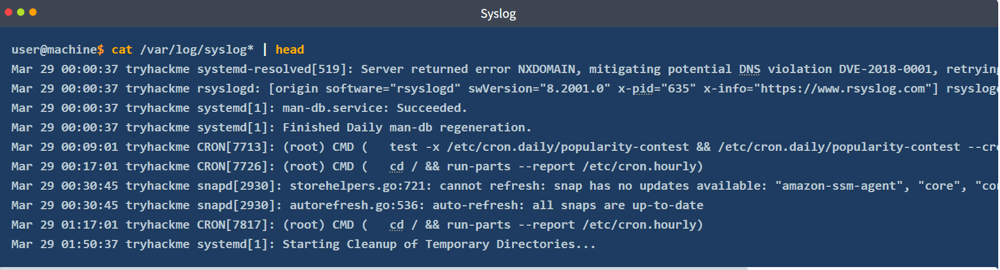
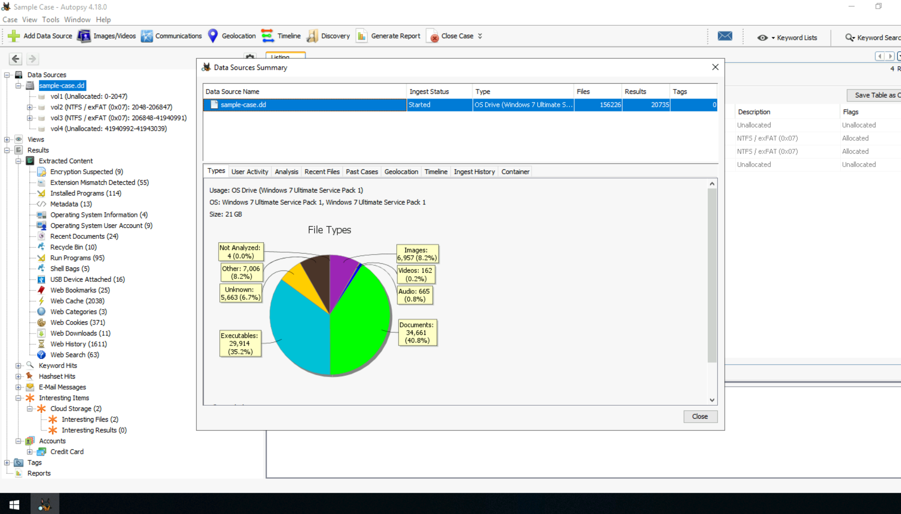
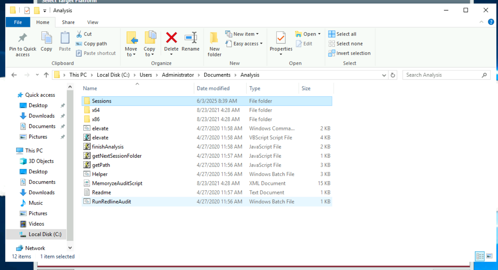
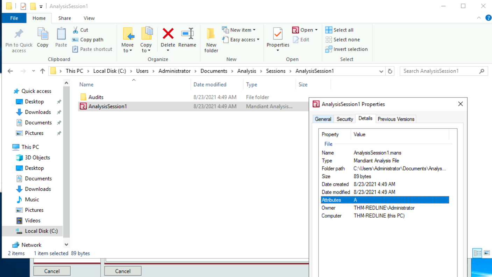
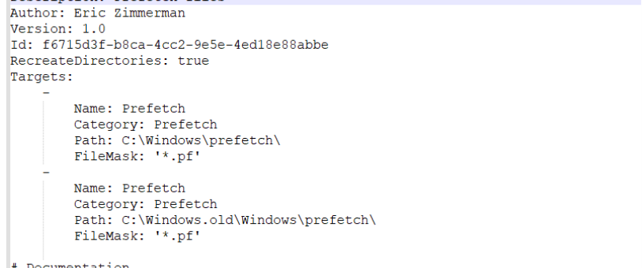
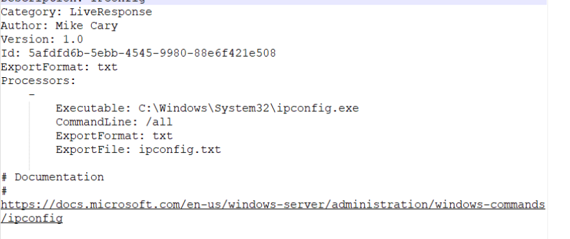
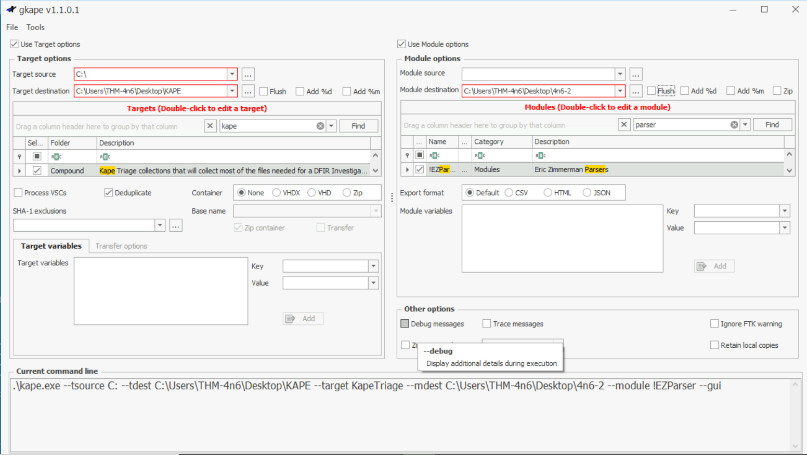
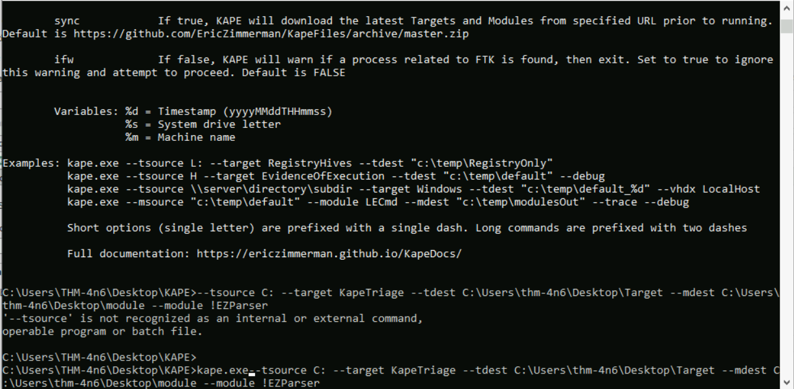

# Room 1
## DFIR
	DFIR stands for Digital Forensics and Incident Response. This field covers the collection of forensic artifacts from digital devices such as computers, media devices, and smartphones to investigate an incident. This field helps Security Professionals identify footprints left by an attacker when a security incident occurs, use them to determine the extent of compromise in an environment, and restore the environment to the state it was before the incident occurred.

**The need for DFIR**
- Finding evidence of attacker activity in the network and sifting false alarms from actual incidents.
- Robustly removing the attacker,  so their foothold from the network no longer remains.
- Identifying the extent and timeframe of a breach. This helps in communicating with relevant stakeholders.
- Finding the loopholes that led to the breach. What needs to be changed to avoid the breach in the future?
- Understanding attacker behavior to pre-emptively block further intrusion attempts by the attacker.
- Sharing information about the attacker with the community.
**Artifact:** are evidence and foot print left by the attacker that point to the activity that was performed on the machine there are used to support hypothesis or claims about the attacker activity  
**Evidence preservation:** When performing DFIR it is important to maintain the integrity of the evidence collected so we must follow some practice 
**Chain of custody:** after the evidence is collected we must make sure that it is kept in secure custody, it must not be in the hand of outsider so the chain isn't  contaminated
**Order of volatility:** the analyst should understand the volatility of the evidence (RAM, disk)
**Timeline creation:** create a chronological order of the evidence to create a story of how thing happened 

#### DFIR process 
 there are multiple stander to follow in trough out DFIR each company publish here's 
 but the most known is this one of NIST :
 - Preparation 
 - Detection and Analysis 
 - Containment, Eradication, and Recovery
 - Post Incident Activity 
And this one of SANS
- Preparation 
- Identification 
- Containment
- Eradication 
- Recovery 
- Lesson learned 

>[!DFIR process]
>1. **Preparation**: Before an incident happens, preparation needs to be done so that everyone is ready in case of an incident. Preparation includes having the required people, processes, and technology to prevent and respond to incidents.
>2. **Identification**: An incident is identified through some indicators in the identification phase. These indicators are then analyzed for False Positives, documented, and communicated to the relevant stakeholders.
>3. **Containment**: In this phase, the incident is contained, and efforts are made to limit its effects. There can be short-term and long-term fixes for containing the threat based on forensic analysis of the incident that will be a part of this phase.
>4. **Eradication**: Next, the threat is eradicated from the network. It has to be ensured that a proper forensic analysis is performed and the threat is effectively contained before eradication. For example, if the entry point of the threat actor into the network is not plugged, the threat will not be effectively eradicated, and the actor can gain a foothold again.
>5. **Recovery**: Once the threat is removed from the network, the services that had been disrupted are brought back as they were before the incident happened.
>6.  **Lessons Learned**: Finally, a review of the incident is performed, the incident is documented, and steps are taken based on the findings from the incident to make sure that the team is better prepared for the next time an incident occurs.

# Room 2
## Windows Forensics 
#### Windows registry 
is a collection of data base that store the system's configuration data, this data can be about the hardware, software or user's info it also include data about recently used programs and file 
These are the Registry that are present in windows 
	1. HKEY_CURRENT_USER : data base that store the configuration of the current user like user folder, control panel setting 
1. HKEY_USERS : is the one that contain the data of all the users of the machine  HKCU is a subkey of HKU
2. HKEY_LOCAL_MACHINE : contain configuration of the machine (for any user) 

3. HKEY_CLASSES_ROOT: this is responsible for affecting the right program to be opened when accessing a file from windows explorer. in early version of windows there was two other Rkry that are used instead of this one ==HKEY_LOCAL_MACHINE\Software\Classes== and ==HKEY_CURRENT_USER\Software\Classes ==
4. HKEY_CURRENT_CONFIG : Contains information about the hardware profile that is used by the local computer at system startup.
**in a disk image you can find the Registry under the** ```C:\Windows\System32\Config```
	1. **DEFAULT** (mounted on `HKEY_USERS\DEFAULT`)
	2. **SAM** (mounted on `HKEY_LOCAL_MACHINE\SAM`)
	3. **SECURITY** (mounted on `HKEY_LOCAL_MACHINE\Security`)
	4. **SOFTWARE** (mounted on `HKEY_LOCAL_MACHINE\Software`)
	5. **SYSTEM** (mounted on `HKEY_LOCAL_MACHINE\System`)
for the hive of user info you can find them under 
	6. **NTUSER.DAT** (mounted on HKEY_CURRENT_USER when a user logs in) `C:\Users\<username>\`
	7. **USRCLASS.DAT** (mounted on HKEY_CURRENT_USER\Software\CLASSES) ```C:\Users\<username>\AppData\Local\Microsoft\Windows```
this is an other important hive where windows save the recently run program `C:\Windows\AppCompat\Programs\Amcache.hve` 
there is also the reg log and back up that can help in forensics both located under the 
==C:\Windows\System32\Config==
#### The way to read Registry 
 Live stream is most of the time not possible since we can't operate on the actual machine we only duplicate the data 
 Disk image : we can't copy the data directly since it's protected so we use tool like 
	- #KAPE 
	- #Autopsy 
	- #FTK_Imager 
After we did extract the Registry we need to read them and since registry editor only work in live stream we are goin to use some tools 
- #Registry_Viewer
- #Zimmerman_Registry_Explorer
- #RegRipper
**We will be using Registry Explorer**
Where to look in the Registry to perform forensic analysis 
- **OS version** ==`SOFTWARE\Microsoft\Windows NT\CurrentVersio`==
- **Current Control Set** is the hive that contain the machine configuration data most of the time we find two  ControlSet001(this is used to boot up the machine must of the time ) and  ControlSet002(this is the last known good configuration) they are located in ==`SYSTEM\ControlSet001`==
- **Computer Name** ==`SYSTEM\CurrentControlSet\Control\ComputerName\ComputerName`==
- **Time Zone Information** ==`SYSTEM\CurrentControlSet\Control\TimeZoneInformation`==
- **Network Interfaces and Past Networks** ==`SYSTEM\CurrentControlSet\Services\Tcpip\Parameters\Interfaces`==
	- the past network a given machine was connected to : ==`SOFTWARE\Microsoft\Windows NT\CurrentVersion\NetworkList\Signatures\Unmanaged`== and ==S`OFTWARE\Microsoft\Windows NT\CurrentVersion\NetworkList\Signatures\Managed`==
>[!Autostart Programs]
>- `NTUSER.DAT\Software\Microsoft\Windows\CurrentVersion\Run`
>- `NTUSER.DAT\Software\Microsoft\Windows\CurrentVersion\RunOnce`
>- `SOFTWARE\Microsoft\Windows\CurrentVersion\RunOnce`
>- `SOFTWARE\Microsoft\Windows\CurrentVersion\policies\Explorer\Run`
>- `SOFTWARE\Microsoft\Windows\CurrentVersion\Run`
>this one is for services 
>- `SYSTEM\CurrentControlSet\Services`

- **SAM hive and user information** ==`SAM\Domains\Account\Users`==
-  **Recent Files** for recent opened file ==`NTUSER.DAT\Software\Microsoft\Windows\CurrentVersion\Explorer\RecentDocs`==
- **Office file** are located in ==`NTUSER.DAT\Software\Microsoft\Office\VERSION |NTUSER.DAT\Software\Microsoft\Office\VERSION\UserMRU\LiveID_####\FileMRU`==
>[!**ShellBags**]
>`USRCLASS.DAT\Local Settings\Software\Microsoft\Windows\Shell\Bags`
>`USRCLASS.DAT\Local Settings\Software\Microsoft\Windows\Shell\BagMRU`
>`NTUSER.DAT\Software\Microsoft\Windows\Shell\BagMRU`
>`NTUSER.DAT\Software\Microsoft\Windows\Shell\Bags`

- **Open/Save and LastVisited Dialog MRUs**
	- ==`NTUSER.DAT\Software\Microsoft\Windows\CurrentVersion\Explorer\ComDlg32\OpenSavePIDlMRU`== - ==`NTUSER.DAT\Software\Microsoft\Windows\CurrentVersion\Explorer\ComDlg32\LastVisitedPidlMRU`==
-  **Windows Explorer Address/Search Bars**
	- ==`NTUSER.DAT\Software\Microsoft\Windows\CurrentVersion\Explorer\TypedPaths`==
	- ==`NTUSER.DAT\Software\Microsoft\Windows\CurrentVersion\Explorer\WordWheelQuery`==
- **UserAssist** are listing program that were run using explorer 
	- ==`NTUSER.DAT\Software\Microsoft\Windows\Currentversion\Explorer\UserAssist\{GUID}\Count`==
- **ShimCache** is used to track the compatibility of the app running in the machine with windows 
	- ==`SYSTEM\CurrentControlSet\Control\Session Manager\AppCompatCache`==
	- to view this we need a tirth tool `AppCompatCacheParser.exe --csv <path to save output> -f <path to SYSTEM hive for data parsing> -c <control set to parse>`
- **AmCache** here we can find info about the last run program 
	- ==`Amcache.hve\Root\File\{Volume GUID}\`==
- **BAM/DAM** background activity monitoring and desktop activity moderator 
	- ==`SYSTEM\CurrentControlSet\Services\bam\UserSettings\{SID}`==
	- ==`SYSTEM\CurrentControlSet\Services\dam\UserSettings\{SID}`==
- **Device identification** this location keep track of the USB plugged in the machine 
	- ==`SYSTEM\CurrentControlSet\Enum\USBSTOR`==
	- ==`SYSTEM\CurrentControlSet\Enum\USB`==
>[!**First/Last Times ** ]
>Similarly, the following registry key tracks the first time the device was connected, the last time it was connected and the last time the device was removed from the system.
`SYSTEM\CurrentControlSet\Enum\USBSTOR\Ven_Prod_Version\USBSerial#\Properties\{83da6326-97a6-4088-9453-a19231573b29}\#### `
>In this key, the #### sign can be replaced by the following digits to get the required information:
>- 0064 : First Connection time
>- 0066 : Last Connection time
>- 0067 : Last removal time|
- **USB device Volume Name** 
	- ==`SOFTWARE\Microsoft\Windows Portable Devices\Devices`==
[[Windows Forensics Cheatsheet.pdf]]

# Room 3 
## Windows Forensics 2
windows registry are not the only source of artifact there are other place a forensic analysis should look into 
#### **FAT** 
A storage device in a machine line say a hard drive is just a collection of bit, to convert these bits into a useful and meaningful information we need to organize these bits here come the use of file system 
**File Allocation Table** is the file system used by windows since the 70 but it no longer paly the main on as it sound the system create a table on index for each file [index -> file location]
##### Data Structure of FAT:
- Cluster : the basic storage unit 
- Directory : meta data of the file
- File Allocation Table : is a linked list of all clusters 
##### FAT12, FAT16, and FAT32

| **Attribute**                  | **FAT12**  | **FAT16**  | **FAT32**   |
| ------------------------------ | ---------- | ---------- | ----------- |
| **Addressable bits**           | 12         | 16         | 28          |
| **Max number of clusters**     | 4,096      | 65,536     | 268,435,456 |
| **Supported size of clusters** | 512B - 8KB | 2KB - 32KB | 4KB - 32KB  |
| **Maximum Volume size**        | 32MB       | 2GB        | 2TB         |
#####  **exFAT** 
	Came to solve the problem of storage limitaion and it's now the default file system for any SD card larger that 32GB

####  **NTFS**
	New Technoologie File System was created by windows in 1993 ans it become since then the one used in windows OS
	here are some of it feature :
	- Journaling: it keeps a a log to change to the metadata in the volumes in case of lost or data cruch
	- Access controls: access based on the file or directory permission 
	- Volume Shadow Copy : keeps track of change made to file which allow user to restor previous version 
	- Alternate Data Streams : allow the file to have multipl file stream 
	- Master File Table : a structured data base used to track object stored on the volume. Here are some of the file that are useful for digital forensic:
		- $MFT : is the first record on the volumes it stores info about the cluster of all other object on the volume
		- $LOGFILE :  stores the transactional logging of the file system. It helps maintain the integrity of the file system in the event of a crash.
		- $UsnJrnl : Update Sequence Number (USN) Journal. It is present in the $Extend record. It contains information about all the files that were changed in the file system and the reason for the change. It is also called the change journal.
#### Recovering deleted file 
##### Disk Image:
	A disk image file is a file that contains a bit-by-bit copy of a disk drive. A bit-by-bit copy saves all the data in a disk image file, including the metadata, in a single file. Thus, while performing forensics, one can make several copies of the physical evidence, i.e., the disk, and use them for investigation. This helps in two ways. 1) The original evidence is not contaminated while performing forensics, and 2) The disk image file can be copied to another disk and analyzed without using specialized hardware.
##### Autopsy
can be used to read disk images and also to extract the deleted file from the image to the machine 
#### Windows Prefetch files
	When a program is run in Windows, it stores its information for future use. This stored information is used to load the program quickly in case of frequent use. This information is stored in prefetch files which are located in the `C:\Windows\Prefetch` directory with the extenton of pf.
#### Windows 10 Timeline
	Windows 10 stores recently used applications and files in an SQLite database called the Windows 10 Timeline. This data can be a source of information about the last executed programs. It contains the application that was executed and the focus time of the application. The Windows 10 timeline can be found at the following location:
==C:\Users\<username>\AppData\Local\ConnectedDevicesPlatform\{randomfolder}\ActivitiesCache.db==
####  Windows Jump Lists 
	Windows introduced jump lists to help users go directly to their recently used files from the taskbar. We can view jumplists by right-clicking an application's icon in the taskbar, and it will show us the recently opened files in that application. This data is stored in the following directory
==`C:\Users\<username>\AppData\Roaming\Microsoft\Windows\Recent\AutomaticDestinations`==
####  Shortcut Files
	Windows creates a shortcut file for each file opened either locally or remotely. The shortcut files contain information about the first and last opened times of the file and the path of the opened file, along with some other data. Shortcut files can be found in the following locations:
==`C:\Users\<username>\AppData\Roaming\Microsoft\Windows\Recent\`==
==`C:\Users\<username>\AppData\Roaming\Microsoft\Office\Recent\`==
#### IE/Edge history
	An interesting thing about the IE/Edge browsing history is that it includes files opened in the system as well, whether those files were opened using the browser or not. Hence, a valuable source of information on opened files in a system is the IE/Edge history. We can access the history in the following location
==`C:\Users\<username>\AppData\Local\Microsoft\Windows\WebCache\WebCacheV*.dat`==
#### Setupapi dev logs for USB devices
	When any new device is attached to a system, information related to the setup of that device is stored in the `setupapi.dev.log`. This log is present at the following location:
==`C:\Windows\inf\setupapi.dev.log`==

# Room 4 
## Linux Forensics
Linux is a wide spread OS that is used in much of our electronics since it's light weigh and can be customized that why it's critical to know how to access it file and do forensics on it.
here are some of the file that are useful when performing forensics:
#### OS release information
for info about the OS release ==`/etc/os-release`==
#### User accounts 
info about the user of the system. The output contains 7 colon-separated fields, describing username, password information, user id (uid), group id (gid), description, home directory information, and the default shell that executes when the user logs in ==`/etc/passwd`==
for the file that hold the password of the users it's located in ==`/etc/shadow`==
#### Group Information
this file contain info about the user group of the machine ==`/etc/group`==
#### Sudoers List 
this contain a list of the user that can elevate their privileges using the sudo ==`/etc/soudoers`==
#### Login information 
There are two kind of file to look for the wtmp for login history and dtmp for failed login there are both located under the ==`/var/log/wtmp or /var/log/dtmp `== there are binay file so we read them using the `last` command 
#### Authentication logs 
Every user that authenticates on a Linux host is logged in the auth log. ==`/var/log/auth.log`==
##### Hostname
 the hostname info ==`/etc/hostname`==
#### Timezone
info about the time zone  ==` /etc/timezone`==
#### Network Configuration 
info about the network interface ==`/etc/network/interfaces`==
#### Active network connections
On a live system, knowing the active network connections provides additional context to the investigation ==`netstat -natp`== utility 
#### Running processes
==`ps -aux`==
#### DNS information 
The file ==`/etc/hosts`== contains the configuration for the DNS name assignment
for the DNS server used to resolve address by Linux it's located in ==`/etc/resolv.conf`==
#### Persistence mechanisms
Persistence mechanisms are ways a program can survive after a system reboot 
#####  Cron jobs
A list of command that run periodically after a set amount of time there are located under ==`/etc/crontab`==
#####  Service startup
Like windows, service can be set up to run in the background after every system boot
a list of this services ca be found under ==``/etc/init.d``==
##### Bashrc
this is a file that is run every time you start a terminal session 
it's is located under ==~/.bashrc==
System-wide settings are stored in ==`/etc/bash.bashrc`== and ==`/etc/profile`== files, so it is often a good idea to take a look at these files as well.
#### Evidence of Execution
##### Sudo execution history
Every command that is run using the sudo command is logged in auth.log so we can filter out the command we want for example ==`cat /var/log/auth.log* |grep -i COMMAND|tail`== 
#####  Bash history
Any command that is run without the Sudo is stored under the bash history in the user folder home. we should look into all the users bash history also the root ==`~/.bash_history`==
#####  Files accessed using vim
File that are opened by vim are kept in history by Vim under ==`~/.viminfo`== in the home directory 
#### LOG files
##### Syslog
The Syslog contains messages that are recorded by the host about system activity. The detail which is recorded in these messages is configurable through the logging level.
==`/var/log/syslog`==

	The above terminal shows the system time, system name, the process that sent the log [the process id], and the details of the log. We can see a couple of cron jobs being run here in the logs above, apart from some other activity. We can see an asterisk(*) after the syslog. This is to include rotated logs as well. With the passage of time, the Linux machine rotates older logs into files such as syslog.1, syslog.2 etc, so that the syslog file doesn't become too big. In order to search through all of the syslogs, we use the asterisk(*) wildcard.
##### Auth logs
We have already discussed the auth logs in the previous tasks. The auth logs contain information about users and authentication-related logs. The below terminal shows a sample of the auth logs.
#####  Third-party logs
==/var/log/==

# Room 5
## Autopsy 
	_Autopsy is the premier open source forensics platform which is fast, easy-to-use, and capable of analysing all types of mobile devices and digital media. Its plug-in architecture enables extensibility from community-developed or custom-built modules. Autopsy evolves to meet the needs of hundreds of thousands of professionals in law enforcement, national security, litigation support, and corporate investigation_
Autopsy is an open-source and powerful digital forensics platform. Several features within Autopsy have been developed with funding from the Department of Homeland Security Technology
##### Basic workflow
1. Create/open the case for the data source you will investigate
2. Select the data source you wish to analyze
3. Configure the ingest modules to extract specific artifacts from the data source
4. Review the artifacts extracted by the ingest modules
5. Create the report
Supported Disk Image Formats:
- **Raw Single** (For example: *.img, *.dd, *.raw, *.bin)
- **Raw Split** (For example: *.001, *.002, *.aa, *.ab, etc)
- **EnCase** (For example: *.e01, *.e02, etc)
- **Virtual Machines** (For example: *.vmdk, *.vhd*)
##### Ingest Modules
Essentially, **Ingest Modules** are Autopsy plug-ins. Each Ingest Module is designed to analyze and retrieve specific data from the drive. You can configure Autopsy to run specific modules during the source-adding stage or later by choosing the target data source available on the dashboard.

##### Data Sources Summary


# Room 6 
## Redline
Is a Fire eye tool used for forensic and analysis it provide the analysis with mush leverage over the system like :
- Collect registry data (Windows hosts only)
- Collect running processes
- Collect memory images (before Windows 10)
- Collect Browser History
- Look for suspicious strings
- And much more!
##### Data collection 
there are three main way to collect data 
1. Standard Collector  - this method configures the script to gather a minimum amount of data for the analysis. This is going to be our preferred method to collect data in this room. It is also usually the fastest method to collect the data you need. It takes only a few minutes to complete.
2. Comprehensive Collector  - this method configures the script to gather the most data from your host for further analysis. This method takes up to an hour or more. You will choose this method if you prefer the full analysis of the system.
3. IOC Search Collector  (Windows only) - this method collects data that matches with the  [Indicators of Compromise (IOCs)](https://www.crowdstrike.com/cybersecurity-101/indicators-of-compromise/)  that you created with the help of  [IOC Editor](https://fireeye.market/apps/S7cWpi9W) . You will choose this method if you want to run the data collection against known IOCs that you have gathered either through threat intelligence (data feed or narrative report), incident response, or malware analysis. You imported them into  [IOC Editor](https://fireeye.market/apps/S7cWpi9W) . We'll look at the IOC Editor a bit further in the next task.
after completing the filling of the data we get at the end a file named `RunRedlineAudit.bat` this is the file we use for auditing after it finish runing we get the result under Session 



# Room 7 
## KAPE 
Kroll Artifact Parser and Extractor (KAPE) parses and extracts Windows forensics artifacts. It is a tool that can significantly reduce the time needed to respond to an incident by providing forensic artifacts from a live system or a storage device much earlier than the imaging process completes.
KAPE serves two primary purposes, 1) collect files and 2) process the collected files as per the provided options. For achieving these purposes, KAPE uses the concept of targets and modules. Targets can be defined as the forensic artifacts that need to be collected. Modules are programs that process the collected artifacts and extract information from them. We will learn about them in the upcoming tasks.
#### Target Option 
In KAPE's lexicon, `Targets` are the artifacts that need to be collected from a system or image and copied to our provided destination. For example, as we learned in the last room, Windows Prefetch is a forensic artifact for evidence of execution so that we can create a `Target` for it

**compound**
**!Disabled**
This directory contains `Targets` that you want to keep in the KAPE instance, but you don't want them to appear in the active Targets list.
 **!Local**
If you have created some `Targets` that you don't want to sync with the KAPE Github repository, you can place them in this directory. These can be `Targets` that are specific to your environment. Similarly, anything not present in the Github repository when we update KAPE will be moved to the `!Local` directory
#### Module Option 
`Modules`, in KAPE's lexicon, run specific tools against the provided set of files. Their goal is not to copy files from one place to another but rather run some command and store the output. Generally, the output is in the form of CSV or TXT files.

#### Gkape 

#### Ckape 


# Room 8
## Volatility 
Volatility is a free memory forensics tool developed and maintained by Volatility Foundation, commonly used by malware and SOC analysts within a blue team or as part of their detection and monitoring solutions. Volatility is written in Python and is made up of python plugins and modules designed as a plug-and-play way of analyzing memory dumps.
Extracting a memory dump can be performed in numerous ways, varying based on the requirements of your investigation. Listed below are a few of the techniques and tools that can be used to extract a memory from a bare-metal machine.
- memory forensics have two phase :
	- memory Acquisition
	- 
- FTK Imager
- Redline
- DumpIt.exe
- win32dd.exe / win64dd.exe
- Memoryze
- FastDump
The naming structure of plugins has also changed. In previous versions of Volatility, the naming convention has been simply the name of the plugin and was universal for all operating systems and profiles. Now with Volatility3, you need to specify the operating system prior to specifying the plugin to be used, for example, `windows.info` vs `linux.info`. This is because there are no longer profiles to distinguish between various operating systems for plugins as each operating system has drastically different memory structures and operations. Look below for options of operating system plugin syntax.

- .windows
- .linux
- .mac
>[!Volatility]
>- Pslist is used to list all the process that are stored in the list of memory dump
>		  ==`python3 vol.py -f <file> windows.pslist`==
>- Some malware 'RootKits' will hide there process by unlinking there self from the list to locate them we use ==`psscan`==  
>   ==`python3 vol.py -f <file> windows.psscan`== 
 - `pstree` this one list the process based on the parent process ID
>	`python3 vol.py -f <file> windows.pstree`
 - For identifying network connection we use ==`netstat`==
> 	  `python3 vol.py -f <file> windows.netstat`  
> - Dlllist is a way to list the ddl file that have a relation with the process running 
> `python3 vol.py -f <file> windows.dlllist`

> - malfind this one is used to find injected process and there PID 
> 	`python3 vol.py -f <file> windows.malfind`
> - yarascan compare the memory file against yara rule 
> 	`python3 vol.py -f <file> windows.yarascan`

#### Hooking 
Hooking involves inserting code that "hooks" into existing functions or processes to monitor, modify, or redirect their behavior. While hooking has legitimate uses in software development and system monitoring, attackers exploit it maliciously.
there are five methods of hooking employed by adversaries, outlined below:
- SSDT Hooks
- IRP Hooks
- IAT Hooks
- EAT Hooks
- Inline Hooks
- The `ssdt` plugin will search for hooking and output its results. `python3 vol.py -f <file> windows.ssdt`
- he `modules` plugin will dump a list of loaded kernel modules `python3 vol.py -f <file> windows.modules`
- The `driverscan` plugin will scan for drivers present on the system at the time of extraction. `python3 vol.py -f <file> windows.driverscan`
- here are some more plugin that might me help full when looking for advanced malware memory 
	- - `modscan`
	- `driverirp`
	- `callbacks`
	- `idt`
	- `apihooks`
	- `moddump`
	- `handles`
- The `windows.memmap.Memmap` plugin in Volatility is used to display the physical memory map of a Windows system from a memory dump.

# Room 9 
## **Velociraptor**
**Velociraptor** is an open source advance endpoint monitoring, digital forensic and cyber response platform 
the velociraptor executable is unique since it can run as a server or a client and it' s compatible with the three OS
- to run the app a server we use the command 
	- `./velociraptor-v0.5.8-linux-amd64 --config server.config.yaml frontend -v`
- to add a windows client we use the command  
	- `velociraptor-v0.5.8-windows-amd64.exe --config velociraptor.config.yaml client -v`
- VQL 
At the date of the entry of this content, below are the categories surrounding forensic analysis:
	- **Searching Filenames**
	- **Searching Content**
	- **NTFS Analysis**
	- **Binary Parsing**
	- **Evidence of Execution**
	- **Event Logs**
	- **Volatile Machine State**
# Room 10 
## The HIVE Project 
TheHive Project is a scalable, open-source and freely available Security Incident Response Platform, designed to assist security analysts and practitioners working in SOCs, CSIRTs and CERTs to track, investigate and act upon identified security incidents in a swift and collaborative manner.
TheHive Project operates under the guide of three core functions:
- **Collaborate:** Multiple analysts from one organisation can work together on the same case simultaneously. Through its live stream capabilities, everyone can keep an eye on the cases in real time.
- **Elaborate:** Investigations correspond to cases. The details of each case can be broken down into associated tasks, which can be created from scratch or through a template engine. Additionally, analysts can record their progress, attach artifacts of evidence and assign tasks effortlessly.
- **Act:** A quick triaging process can be supported by allowing analysts to add observables to their cases, leveraging tags, flagging IOCs and identifying previously seen observables to feed their threat intelligence.
##### **Hive advantage**
- **Case/Task Management:** Every investigation is meant to correspond to a case that has been created. Each case can be broken down into one or more tasks for added granularity and even be turned into templates for easier management. Additionally, analysts can record their progress, attach pieces of evidence or noteworthy files, add tags and other archives to cases.
- **Alert Triage:** Cases can be imported from SIEM alerts, email reports and other security event sources. This feature allows an analyst to go through the imported alerts and decide whether or not they are to be escalated into investigations or incident response.
- **Observable Enrichment with Cortex:** One of the main feature integrations TheHive supports is Cortex, an observable analysis and active response engine. Cortex allows analysts to collect more information from threat indicators by performing correlation analysis and developing patterns from the cases. 
- **Active Response:** TheHive allows analysts to use Responders and run active actions to communicate, share information about incidents and prevent or contain a threat.
- **Custom Dashboards:** Statistics on cases, tasks, observables, metrics and more can be compiled and distributed on dashboards that can be used to generate useful KPIs within an organisation.
- **Built-in MISP Integration:** Another useful integration is with [MISP](https://www.misp-project.org/index.html), a threat intelligence platform for sharing, storing and correlating Indicators of Compromise of targeted attacks and other threats. This integration allows analysts to create cases from MISP events, import IOCs or export their own identified indicators to their MISP communities
>[!Permission]
>|   |   |
|---|---|
|Permission|Functions|
|**manageOrganisation (1)  <br>**|Create & Update an organisation|
|**manageConfig (1)  <br>**|Update Configuration|
|**manageProfile (1)  <br>**|Create, update & delete Profiles|
|**manageTag (1)  <br>**|Create, update & Delete Tags|
|**manageCustomField (1)  <br>**|Create, update & delete Custom Fields|
|**manageCase  <br>**|Create, update & delete Cases|
|**manageObservable  <br>**|Create, update & delete Observables|
|**manageALert  <br>**|Create, update & import Alerts|
|**manageUser  <br>**|Create, update & delete Users|
|**manageCaseTemplate  <br>**|Create, update & delete Case templates|
|**manageTask  <br>**|Create, update & delete Tasks|
|**manageShare**|Share case, task & observable with other organisations|
|**manageAnalyse (2)  <br>**|Execute Analyse|
|**manageAction (2)  <br>**|Execute Actions|
|**manageAnalyserTemplate (2)  <br>**|Create, update & delete Analyser Templates|

# Room 11
## intro to Malware analysis 
#### Malware
The word malware is derived from the term MALicious softWARE. Therefore, any software that has a malicious purpose can be considered malware. Malware is further classified into different categories based on its behavior. However, we will not go into the details of those in this room. Here we will ponder the steps we will take if we suspect that we found malware in a machine. So, let's get started.
#### The purpose behind Malware Analysis
Malware Analysis is an important skill to have. As a quick overview, Malware Analysis is performed by the following people in the Security Industry:

- **Security Operations** teams analyze malware to write detections for malicious activity in their networks.
- **Incident Response** teams analyze malware to determine what damage has been done to an environment to remediate and revert that damage.
- **Threat Hunt** teams analyze malware to identify IOCs, which they use to hunt for malware in a network.
- **Malware Researchers** in security product vendor teams analyze malware to add detections for them in their security products.
- **Threat Research** teams in OS Vendors like Microsoft and Google analyze malware to discover the vulnerabilities exploited and add more security features to the OS/applications.

Always take the following precautions while analyzing malware:
- Never analyze malware or suspected malware on a machine that does not have the sole purpose of analyzing malware.
- When not analyzing or moving malware samples around to different locations, always keep them in password-protected zip/rar or other archives so that we can avoid accidental detonation.
- Only extract the malware from this password-protected archive inside the isolated environment, and only when analyzing it.
- Create an isolated VM specifically for malware analysis, which has the capability of being reverted to a clean slate once you are done.
- Ensure that all internet connections are closed or at least monitored.
- Once you are done with malware analysis, revert the VM to its clean slate for the next malware analysis session to avoid residue from a previous malware execution corrupting the next one.
#### Static and Dynamic Malware analysis 
- static analysis is when we analyze the Malware without running it like looking for string and accessing the code with a third parti software 
- Dynamic analysis is when we analyze the malware while it's performing it work in a controlled virement like a VM or a Sand box 
>[!Static Analysis]
>- File extension `file` command 
>- Examining Strings to list the strings present in the  file `strings` command
>- Hash calculation `md5sum`, `sha56sum`, ``sha1sum` 
>- PE Header contain vital info for the analysis of the malware, we can use the `pecheck` tool to check the PE header  

>[!Dynamic Analysis]
>Sand box [Cuckoo's Sandbox,  CAPE Sandbox]
>Some online sandbox 
>- [Online Cuckoo Sandbox](https://cuckoo.cert.ee/)
>- [Any.run](https://any.run/)
>- [Intezer](https://analyze.intezer.com/)
>- [Hybrid Analysis](https://hybrid-analysis.com/)
## Sandbox evasion:

As we have seen previously, we can always run a sample in a sandbox to analyze it. In many cases, that might help us analyze samples that evade our basic static analysis techniques. However, malware authors have some tricks up their sleeves that hamper that effort. Some of these techniques are as follows:

- **Long sleep calls:** Malware authors know that sandboxes run for a limited time. Therefore, they program the malware not to perform any activity for a long time after execution. This is often accomplished through long sleep calls. The purpose of this technique is to time out the sandbox.
- **User activity detection:** Some malware samples will wait for user activity before performing malicious activity. The premise of this technique is that there will be no user in a sandbox. Therefore there will be no mouse movement or typing on the keyboard. Advanced malware also detects patterns in mouse movements that are often used in automated sandboxes. This technique is designed to bypass automated sandbox detection.
- **Footprinting user activity:** Some malware checks for user files or activity, like if there are any files in the MS Office history or internet browsing history. If no or little activity is found, the malware will consider the machine as a sandbox and quit. 
- **Detecting VMs:** Sandboxes run on virtual machines. Virtual machines leave artifacts that can be identified by malware. For example, some drivers installed in VMs being run on VMWare or Virtualbox give away the fact that the machine is a VM. Malware authors often associate VMs with sandboxes and would terminate the malware if a VM is detected.
